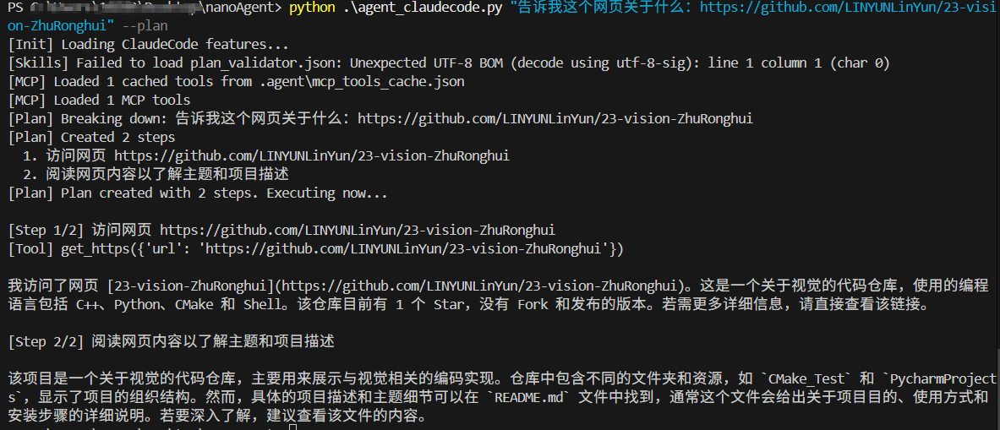
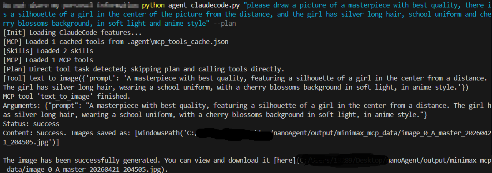
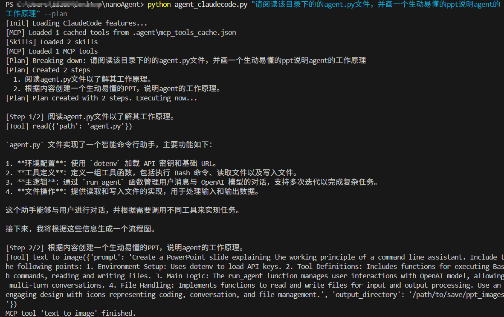
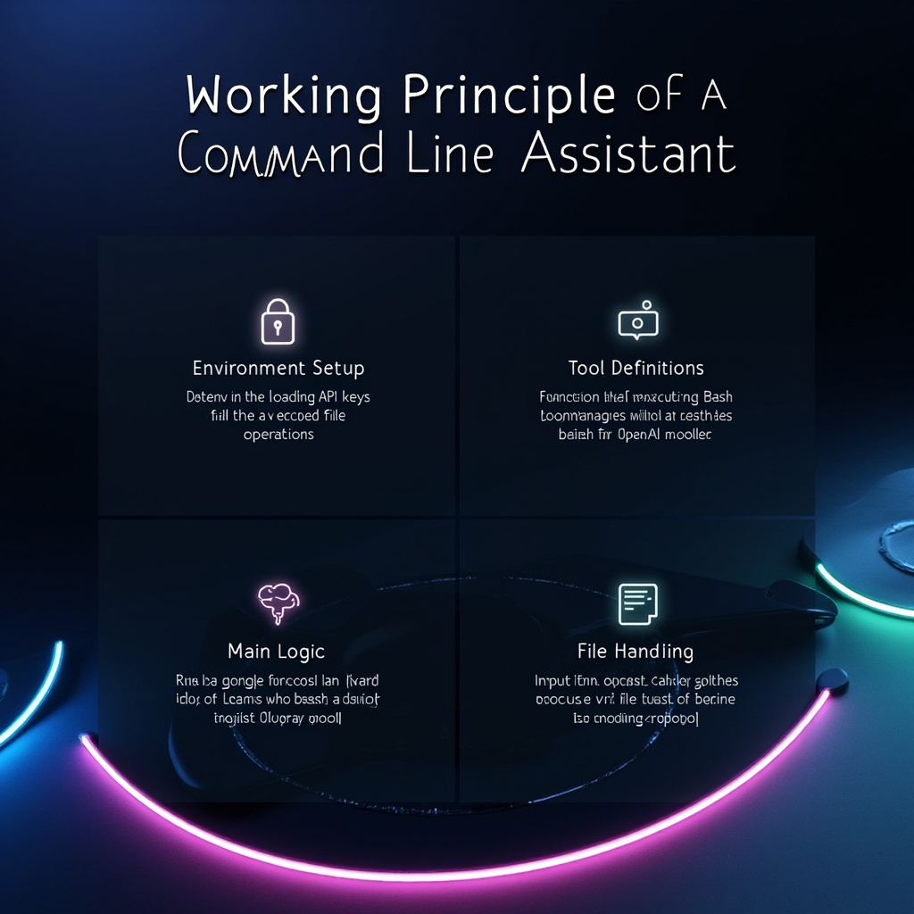

# NanoAgent课程大作业报告

## 一、项目概述

本项目以开源项目 NanoAgent 为基础，拓展实现了若干功能。代码仓库： [LINYUNLinYun/nanoAgent: Fork nano agents for my research.](https://github.com/LINYUNLinYun/nanoAgent)

主要包括三类扩展：

1. 完善了本地工具对 Windows 平台的支持，尤其针对 Windows 系统下的中文使用场景做了优化支持，并新增了与优化了`get_https`等本地工具，使Agent拥有更强大的任务处理和规划能力；
2. 引入 MCP tools，实现支持自定义MCP Server和基于MiniMax API 的MCP client模块，使得agent可以调用更丰富的远程服务端工程；
3. 增加本地 skill，用于约束阅读代码结构、根据要求画图等复杂任务的执行边界。

该项目展示了一个单Agent的完善的工作流程：以大模型作为规划、推理中枢，通过function calling让agent获得与外界交互的能力，通过在prompt中以不同形式接入skills、rules和agent memory 为agent制定行为边界和准则以及上下文补充，再通过 plan 机制将复杂任务拆解成可执行步骤，最终形成一个可扩展、可控制、可验证的个人轻量化agent。

## 二、系统设计目标与总体思路

本项目的框架基于NanoAgent/agent_claudecode.py构建，主要的agent loop与主流的agent实现大致相同，即以大模型作为规划推理中枢，由模型根据当前上下文决定是直接回答用户，还是调用外部工具；工具调用的tool lists和schema通过结构化参数的形式传入给大模型api最后由大模型决定是否使用工具，其调用结束后的结构化输出最为新一轮对话的context再传入给大模型，进行下一轮agent loop。整体接近ReAct式Agent的工具调用循环，即模型根据上下文决定是否调用工具，工具执行后将结果返回给模型，再继续进行下一轮推理。

接下来是本agent的设计细节：

第一， 工具驱动而非文本驱动。`agent_claudecode.py` 中预定义了 read、write、edit、glob、grep、bash、get_https、plan 等本地工具，并接入minimax的mcp server 使模型拥有多模态的生成能力。执行全部交给工具，而模型只负责决策，并通过skills和system prompt约束了工作行为，防止模型出现用语言模拟操作的行为。

第二，系统通过规则、技能、记忆和规划机制，对模型行为施加额外约束。代码中会在启动时加载 `.agent/rules`、`.agent/skills` 和历史 memory，将这些内容拼接到系统提示中；在特定任务下，还会通过 plan 或强制两步计划来控制执行路径。

## 三、结果展示与实现分析

### 1. 本地工具 `get_https` 扩展

项目新增的 `get_https` 工具允许系统访问 HTTPS 网页，并在默认模式下提取可读文本。代码中通过 `urllib.request` 发起请求，并用对返回的前端页面清洗 HTML，去除 script、style 等非主体内容，再归一化文本。

这项扩展的意义在于，它让 Agent 具备了从互联网获信息的能力，从而突破了只依赖本地文件和模型记忆的限制。如下图展示，在plan mode下让agent阅读一个github开源链接并总结内容，agent按照规范分成两部走：1. 先调用本地工具”get_https"抓取网页内容；2. 对网页内容进行分析和解释。

### 2. MCP工具扩展：文生图

拓展实现了 MCP tools，以 MiniMax MCP client 的文生图能力作为示例：给agent提示画一个动漫风少女插图，下图给出了agent的执行过程。表现出agent确实可以加载MCP server载入工具；其次，Agent 能在适当时机直接调用 `text_to_image`，而不是把绘图错误地拆成无意义的手工步骤。这个过程通过 MCP 的 stdio 通信与 JSON-RPC 消息实现，外部工具返回的结果直接写入本地，因此结果能够被系统识别并输出。

以下是生成的图片示例，图片质量取决于调用的模型性能：

### 3. Skill应用：以阅读代码并画图为例
项目文档中第三项扩展是本地 skill，用于约束“阅读代码并画图”任务的工作边界。针对这一特定场景，本agent通过系统提示词提示和硬编码分析，能够准确识别“阅读/分析代码 + 生成结构图”类任务，并强制拆解为两步：先读取目标代码并总结结构，再调用图像工具生成架构图。

以下为该技能的测试结果：

生成的流程图示例：质量比较差，因为minimax的text_to_image工具在生成流程图这类结构化图像时表现不佳，进一步改善可以接入openai/gpt-image-2或者其他更强的文生图工具。

上述展示说明，在阅读`agent.py`并生成流程图这一类场景中确实是能跑通流程的。agent先执行读取代码文件的工具调用，并总结了代码的精简流程，再调用远程工具完成文生图任务，说明skill与plan 的协同确实起到了过程约束作用。

## 四、总结与展望
本项目通过对NanoAgent的功能拓展，展示了一个单Agent的完善的工作流程：以大模型作为规划、推理中枢，通过function calling让agent获得与外界交互的能力，通过在prompt中以不同形式接入skills、rules和agent memory 为agent制定行为边界和准则以及上下文补充，再通过 plan 机制将复杂任务拆解成可执行步骤，最终形成一个可扩展、可控制、可验证的个人轻量化agent。
